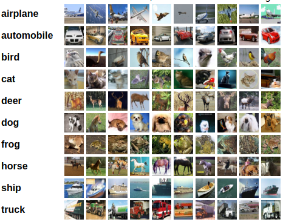

# ZJU Artificial Intelligence Safety HW01

## Introduction
This repository the homework 1 for the Artificial Intelligence Safety course at Zhejiang University.

Instructor: Jie Song

Requirements:
- Creating your own github account.
- Implementing your own deep neural network (in Pytorch, PaddlePaddle...).
- Training it on CIFAR10.
- Tuning a hyper-parameter and analyzing its effects on performance.
- Writing a README.md to report your findings.

## Dataset

The [CIFAR-10](https://www.cs.toronto.edu/~kriz/cifar.html) dataset consists of 60000 32x32 colour images in 10 classes, with 6000 images per class. 
There are 50000 training images and 10000 test images.

The dataset is divided into five training batches and one test batch, each with 10000 images. 
The test batch contains exactly 1000 randomly-selected images from each class. 
The training batches contain the remaining images in random order, but some training batches may contain more images from one class than another. 
Between them, the training batches contain exactly 5000 images from each class.



## Experimental Notes

### Experiment Environment
- CPU: E5-2630L v3
- GPU: RTX3060
- RAM: 30GB
- VRAM: 12GB

### Requirements
- python3
- pytorch
- numpy
- matplotlib
- tqdm

### Model

First I use the model from [PyTorch tutorial for CIFAR-10](https://pytorch.org/tutorials/beginner/blitz/cifar10_tutorial.html).
This model contains 2 convolution layers, 1 pooling layer and 3 fully-connected layers.

```python
class Net(nn.Module):
    def __init__(self):
        super().__init__()
        self.conv1 = nn.Conv2d(3, 6, 5)
        self.pool = nn.MaxPool2d(2, 2)
        self.conv2 = nn.Conv2d(6, 16, 5)
        self.fc1 = nn.Linear(16 * 5 * 5, 120)
        self.fc2 = nn.Linear(120, 84)
        self.fc3 = nn.Linear(84, 10)

    def forward(self, x):
        x = self.pool(nn.functional.relu(self.conv1(x)))
        x = self.pool(nn.functional.relu(self.conv2(x)))
        x = torch.flatten(x, 1) # flatten all dimensions except batch
        x = nn.functional.relu(self.fc1(x))
        x = nn.functional.relu(self.fc2(x))
        x = self.fc3(x)
        return x
```

### Training result
Cross entropy is chosen as the loss function for model training.

First I used SGD(Stochastic gradient descent) as the optimizer. The learning rate is set to 0.01.
The batch size is set to 128.

The acc@1 of test set is 64.79%.

The learning curve is shown below.

With the increase of epoch, train loss decreased continuously, but test loss decreased first and then increased. 
The performance was the best after about 60 rounds. 
Before 60 rounds, it was under-fitting, and after 60 rounds, it was over-fitting.

### Tuning

#### 1. Learning rate

#### 2. Momentum and weight decay

#### 3. Change optimizer

#### 4. Batch size

#### 5. Make model more complex

#### 6. Data augmentation

For more details, see the [ZJU Artificial Intelligence Safety HW01.ipynb](https://github.com/WuTao18/ZJU_Artificial_Intelligence_Safety_HW01/blob/main/ZJU%20Artificial%20Intelligence%20Safety%20HW01.ipynb)

## Reference
- [CIFAR-10 and CIFAR-100 datasets](https://www.cs.toronto.edu/~kriz/cifar.html)
- [PyTorch tutorial for CIFAR-10](https://pytorch.org/tutorials/beginner/blitz/cifar10_tutorial.html)
- [Machine Learning 2021 Spring - Hung-Yi Lee, National Taiwan University](https://speech.ee.ntu.edu.tw/~hylee/ml/2021-spring.html)
- [ML2021-Spring HW01 - Heng-Jui Chang @ NTUEE](https://colab.research.google.com/github/ga642381/ML2021-Spring/blob/main/HW01/HW01.ipynb)
- [ML2021-Spring HW03](https://colab.research.google.com/github/ga642381/ML2021-Spring/blob/main/HW03/HW03.ipynb)
- [TORCHVISION.MODELS](https://pytorch.org/vision/stable/models.html)
