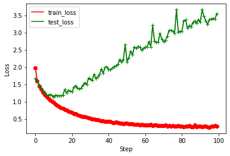
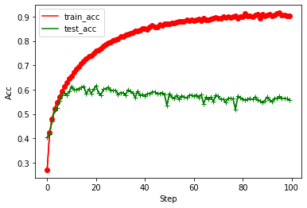
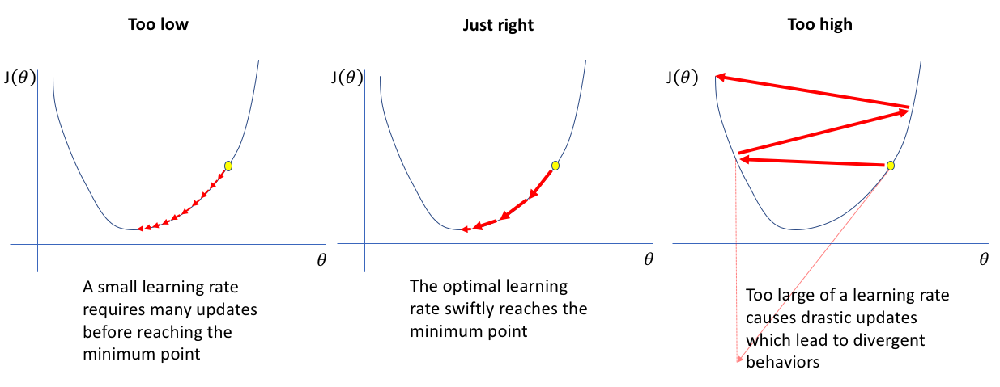
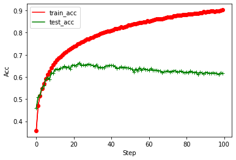

# ZJU Artificial Intelligence Safety HW01

## Table of contents
- [Introduction](#Introduction)
- [Dataset](#Dataset)
- [Experimental notes](#Experimental-notes)
  - [Experiment environment](#Experiment-environment)
  - [Requirements](#Requirements)
  - [Model](#Model)
  - [Training result](#Training-result)
  - [Tuning](#Tuning)
    - [1. Learning rate](#lr)
    - [2. Momentum and weight decay](#momentum)
    - [3. Change optimizer](#adam)
    - [4. Batch size](#batch)
    - [5. Make model more complex](#model)
    - [6. Data augmentation](#augmentation)
- [Reference](#Reference)

## Introduction
This repository the homework 1 for the Artificial Intelligence Safety course at Zhejiang University.

Instructor: Jie Song

Requirements:
- Creating your own github account.
- Implementing your own deep neural network (in Pytorch, PaddlePaddle...).
- Training it on CIFAR10.
- Tuning a hyper-parameter and analyzing its effects on performance.
- Writing a README.md to report your findings.

## Dataset

The [CIFAR-10](https://www.cs.toronto.edu/~kriz/cifar.html) dataset consists of 60000 32x32 colour images in 10 classes, with 6000 images per class. 
There are 50000 training images and 10000 test images.

The dataset is divided into five training batches and one test batch, each with 10000 images. 
The test batch contains exactly 1000 randomly-selected images from each class. 
The training batches contain the remaining images in random order, but some training batches may contain more images from one class than another. 
Between them, the training batches contain exactly 5000 images from each class.


## Experimental notes

### Experiment environment
- CPU: E5-2630L v3
- GPU: RTX3060
- RAM: 30GB
- VRAM: 12GB

### Requirements
- python3
- pytorch
- numpy
- matplotlib
- tqdm

### Model

I use the model from [PyTorch tutorial for CIFAR-10](https://pytorch.org/tutorials/beginner/blitz/cifar10_tutorial.html).
This model contains 2 convolution layers, 1 pooling layer and 3 fully-connected layers.

```python
class Net(nn.Module):
    def __init__(self):
        super().__init__()
        self.conv1 = nn.Conv2d(3, 6, 5)
        self.pool = nn.MaxPool2d(2, 2)
        self.conv2 = nn.Conv2d(6, 16, 5)
        self.fc1 = nn.Linear(16 * 5 * 5, 120)
        self.fc2 = nn.Linear(120, 84)
        self.fc3 = nn.Linear(84, 10)

    def forward(self, x):
        x = self.pool(nn.functional.relu(self.conv1(x)))
        x = self.pool(nn.functional.relu(self.conv2(x)))
        x = torch.flatten(x, 1) # flatten all dimensions except batch
        x = nn.functional.relu(self.fc1(x))
        x = nn.functional.relu(self.fc2(x))
        x = self.fc3(x)
        return x
```

### Training result
Cross entropy is chosen as the loss function for model training.

First I used SGD(Stochastic gradient descent) as the optimizer. The learning rate is set to 0.01.
The batch size is set to 128.

The test set is referred to as the validation set here.

The acc@1 of test set is 67.04%.

The learning curve is shown below.


With the increase of epoch, train loss decreased continuously, but test loss decreased first and then increased. 
The performance was the best at about 70 rounds. 
Before 70 rounds, it was under-fitting, and after 70 rounds, it was over-fitting. 
As the training goes on, the complexity of the model will increase, and over-fitting is easy to occur when the model is overtrained.


The number of epochs is a hyperparameter, too large may lead to over-fitting. 
Methods such as **early stopping** and **weight decay** can be adopted to avoid this situation. 

### Tuning


#### <span id="lr">1. Learning rate</span>
The initial learning rate was set to a very small value (1e-5) and then exponentially increased at each step (1.05 times) for training.
I trained for 236 steps(1.05^236*1e-5 = 1.002), and we can see that the train loss first decreases and then increases, just like a hook.


I chose a learning rate of 0.1 and started training again(It is best to choose the learning rate when loss decreases fastest).

The acc@1 of test set is 61.62%.
The learning curve is shown below.




Compared with the results when the learning rate was 0.01, 
we can see that the convergence process is much faster, the optimum is reached in about 10 steps. 
However, the accuracy is lower.

Small learning rate will slow down the convergence, and large learning rate may be difficult to make the model reach the optimal.



#### <span id="momentum">2. Momentum and weight decay</span>
Momentum is an optimization of the gradient descent. Every movement considers all past gradients.


Momentum can help **escape critical points** (saddle points or local minima) and **accelerate convergence**.

Weight decay is **L2 regularization**, which reduces the problem of over-fitting.

I updated the optimizer parameters (`momentum` and `weight_decay` here are also hyper-parameters) and started training again. 

```python
optim.SGD(model.parameters(), lr=LEARNING_RATE, momentum=0.9, weight_decay=5e-4)
```

The results are as follows. The test result is 61.45%.


  
Compared to the [previous results](#Training-result), the convergence speed becomes faster (because of momentum), 
and the problem of over-fitting is also alleviated (because of weight decay).

#### <span id="adam">3. Change optimizer</span>

Then I changed the optimizer to Adam, which combines RMSprop and Momentum.


The acc@1 of test set is 65.60%.


#### <span id="batch">4. Batch size</span>

I also tried different batch sizes.

Batch size: 32. Acc@1: 64.77%. Elapsed time: 1389s.


Batch size: 64. Acc@1: 64.76%. Elapsed time: 845s.


Batch size: 128. Acc@1: 66.37%. Elapsed time: 552s.




Batch size: 256. Acc@1: 64.54%. Elapsed time: 491s.


| Batch size | Acc@1 | Time |
| ---- | ---- | ---- |
| 32 | 64.77% | 1389s |
| 64 | 64.76% | 845s |
| 128 | 66.37% | 552s |
| 256 | 64.54% | 491s |

Theoretically, small batch size is easier to optimize and has better generalization ability, 
and with a larger batch size, each epoch of training takes less time and training is faster.

In this case, the batch size has no effect on the test acc, the possible reason is that all of them have reached the optimal value.


#### <span id="model">5. Make model more complex</span>

It can be seen that the optimization effect is not obvious after adjusting parameters. 
Train loss and test loss are both relatively high, which should be **Model Bias**. 
Next, I used some more complex models.

- ResNet-18


- ResNet-50


- ResNet-152


- VGG-19 (failed)


- VGG-19 with batch normalization


- Densenet-121


- Densenet-201


| Model  | Acc@1 | Time |
| ---- | ---- | ---- |
| ResNet-18 | 76.64% | 1766s |
| ResNet-50 | 78.59% | 3859s |
| ResNet-152 | 77.95% | 8140s |
| VGG-19 with BN | 85.43% | 4990s |
| Densenet-121 | 80.03% | 7273s |
| Densenet-201 | 79.73% | 10902s |

I didn't change the optimizer and its parameters, so the results are subject to error.

#### <span id="augmentation">6. Data augmentation</span>

Loss on training data is small but loss on testing data is large, its probably over-fitting.

I use data augmentation to alleviate this problem.

```python
transform_train = transforms.Compose([
    transforms.RandomCrop(32,padding=4),
    transforms.RandomHorizontalFlip(),
    transforms.ToTensor(),
    transforms.Normalize(mean = [ 0.4914, 0.4822, 0.4465 ],
                         std  = [ 0.2023, 0.1994, 0.2010 ]),
    ])

transform_test = transforms.Compose([
    transforms.ToTensor(),
    transforms.Normalize(mean = [ 0.4914, 0.4822, 0.4465 ],
                         std  = [ 0.2023, 0.1994, 0.2010 ]),
    ])
```

- ResNet-18


- ResNet-50


- ResNet-152


- VGG-19 (failed)


- VGG-19 with batch normalization


- Densenet-121


- Densenet-201


| Model  | Acc@1 | Time |
| ---- | ---- | ---- |
| ResNet-18 | 84.90% | 3597s |
| ResNet-50 | 85.67% | 7803s |
| ResNet-152 | 86.02% | 19065s |
| VGG-19 with BN | 89.49% | 10036s |
| Densenet-121 | 85.86% | 13772s |
| Densenet-201 | 86.44% | 22602s |

I didn't change the optimizer and its parameters, so the results are subject to error.

We can see that the acc@1 on testing data is improved, and the data augmentation does alleviate the problem of over-fitting.

For more details, see the [ZJU Artificial Intelligence Safety HW01.ipynb](https://github.com/WuTao18/ZJU_Artificial_Intelligence_Safety_HW01/blob/main/ZJU%20Artificial%20Intelligence%20Safety%20HW01.ipynb)

## Reference
- [CIFAR-10 and CIFAR-100 datasets](https://www.cs.toronto.edu/~kriz/cifar.html)
- [PyTorch tutorial for CIFAR-10](https://pytorch.org/tutorials/beginner/blitz/cifar10_tutorial.html)
- [Machine Learning 2021 Spring - Hung-Yi Lee @ National Taiwan University](https://speech.ee.ntu.edu.tw/~hylee/ml/2021-spring.html)
- [ML2021-Spring HW01 - Heng-Jui Chang @ NTUEE](https://colab.research.google.com/github/ga642381/ML2021-Spring/blob/main/HW01/HW01.ipynb)
- [ML2021-Spring HW03](https://colab.research.google.com/github/ga642381/ML2021-Spring/blob/main/HW03/HW03.ipynb)
- [TORCHVISION.MODELS](https://pytorch.org/vision/stable/models.html)
- [GitHub - meliketoy/wide-resnet.pytorch](https://github.com/meliketoy/wide-resnet.pytorch)
